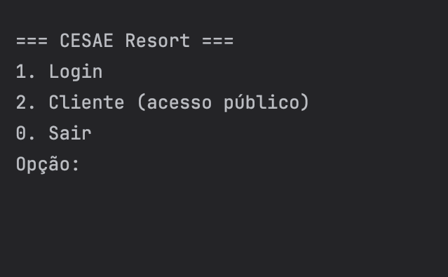
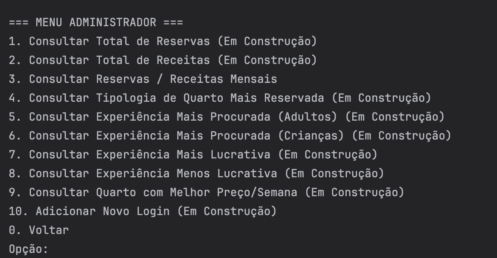
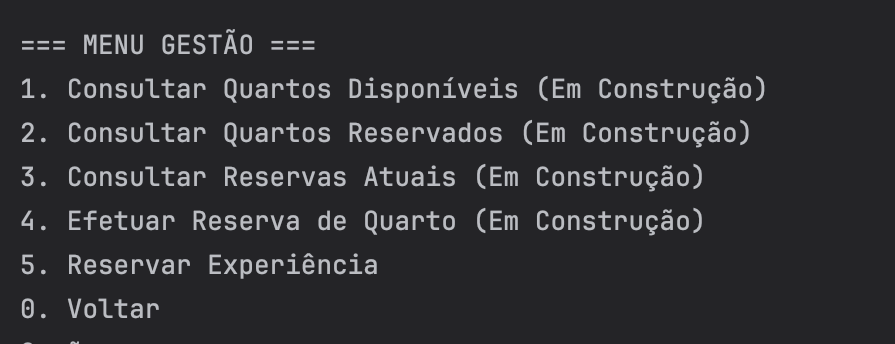
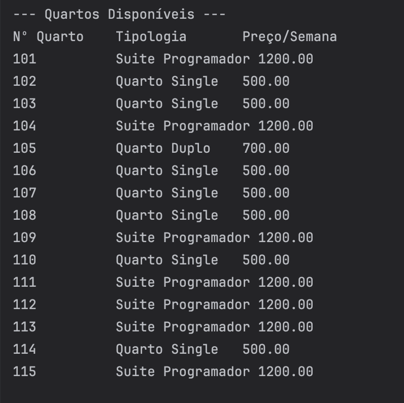

<h1 align="center">🏨 CESAE Resort — Programming Themed Hotel</h1>

<p align="center">
A Java console application that simulates the management of a programming-themed resort,
developed as part of the <strong>Algorithms and Programming</strong> module at CESAE Digital.
</p>

<p align="center">
  
</p>
<p align="center">
  
  
  
</p>

---

# 🖼️ Application Preview

<p align="center">
  
  </p>
  <p align="center">
  
  
  
</p>

---

# 📖 About the Project

**CESAE Resort** is a **Java console application** that simulates the management of a fictional programming-themed hotel resort.

The system allows users to manage:

- rooms  
- experiences  
- reservations  
- customers  
- sales  
- user accounts  

The application follows the **Model–View–Controller (MVC)** architectural pattern and uses **CSV files as the persistent data source**.

The main goal of the project is to demonstrate:

- separation of concerns between layers  
- modular code organization  
- object-oriented programming principles  
- structured application design in Java  

---

# ✨ Main Features

- 🏨 Room management  
- 📅 Reservation system  
- 👥 Customer management  
- 🎟️ Experience and activity catalog  
- 💰 Sales tracking  
- 🔐 User access with role profiles  
- 📊 Data consultation and analysis  
- 📁 Persistent data using CSV files  

---

# 🏗 Architecture

The application follows the **MVC (Model–View–Controller)** architecture:

| Layer | Responsibility |
|------|---------------|
| **Model** | Data structures and business logic |
| **View** | Console interface and user interaction |
| **Controller** | Application flow and coordination between model and view |

This structure ensures better **code organization, maintainability, and scalability**.

---

# 🗂 Project Structure

```
CESAE-Resort/
│
├── src/
│   ├── model/
│   ├── view/
│   ├── controller/
│   └── Main.java
│
├── data/
│   ├── rooms.csv
│   ├── reservations.csv
│   ├── customers.csv
│   └── experiences.csv
│
└── README.md
```

---

# 🛠 Technologies Used

| Technology | Purpose |
|------------|--------|
| **Java** | Core programming language |
| **MVC Pattern** | Application architecture |
| **CSV Files** | Data storage |
| **Console Interface** | User interaction |

---

# 🚀 Running the Project

### Compile the project

```bash
javac -d out $(find src -name "*.java")
```

### Run the application

```bash
java -cp out Main
```

---

# 🎓 Academic Context

This project was developed as part of the **Algorithms and Programming** module at **CESAE Digital**.

The objective was to apply programming concepts such as:

- Object-Oriented Programming
- MVC architecture
- File reading and writing
- Data organisation and processing
- Modular application design

---

# 👩‍💻 Author

**Catarina Rato**

Academic project developed to practice **Java programming, MVC architecture, and structured application design**.

